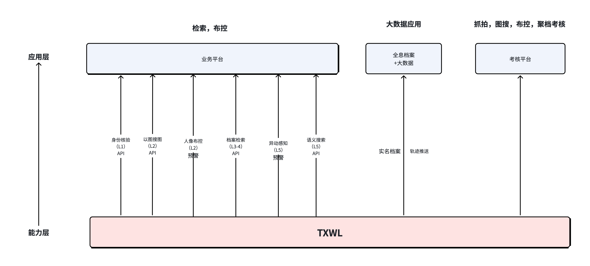
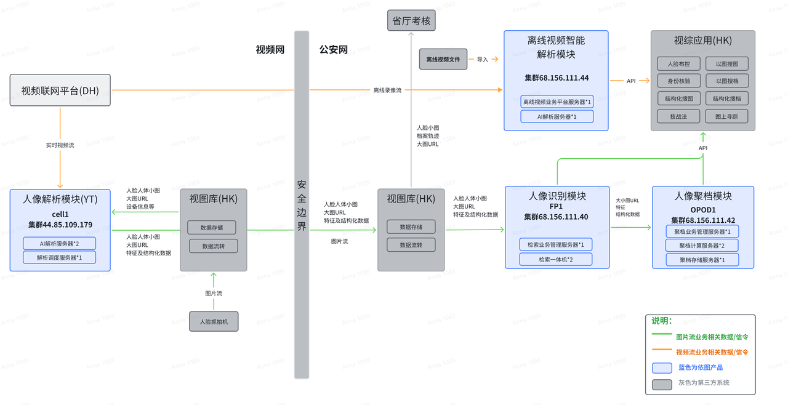

# 客户一页纸-上海闵行

# 基础信息

## 客户定位

- 省区域演进模型为A-E，市局为省内Top X城市，属于区域内重点地市。长期ACV目标为B 200W+.

## BANT、爬坡路径

Prompt：

1. 按因果顺序a)人物-描述-观测-打分 b)痛点-策略的底层逻辑和指导思想-策略-行动 完成表格填写，不要跳步。整体为总分总架构。
2. 明晰三段论，从观测到断言，基于断言再作后续的策略推演
3. 策略的底层原理和指导思想推出策略，本质上是写明白策略的因果，再由策略推出后续动作的分解
4. 重点信息蓝色标出，需要做到层次分明

| 1、XX市局在全国范围内属于拥抱创新的市局 2、历史上因为baidu进入，使得需要多算法的模式引入我司和ST。目前还未赢得明确的Top1的地位。 3、过去的三五年内不确定因为网络还是什么原因，市局排斥视频流，似乎不具备大量推广视频流的IT基础。还未获得结论性断言。 4、市局对各分局没有强约束能力，但分局依旧会视市局为制高点，会借鉴市局引入的短名单。分局的总预算整体上大于市局。 5、A:  (0,1,1) C1 ; N: B (假定为B，尚未明确清晰拿到XX（重要影响人/决策人）的业务上的痛点述求。 6、策略的要点是突破XX(重要影响人)到2，然后拉升N到A。为了突破XX(重要影响人)到2，其中一条可能的策略是拉升X局（决策人）到1。 |   |   |   |   |   |   |   |   |
| --- | --- | --- | --- | --- | --- | --- | --- | --- |
| 蓝色代表重要，如A的三层里的关键人物 |   |   |   |   |   |   |   |   |
| 决策链=（决策人，重要影响人，周边半数）*（观测，断言，策略，行动） |   |   |   |   |   |   |   |   |
| 决策链 |   | 断言 | 观测 |   |   | 策略 |   | 行动 |
| 角色 | 人物 | 打分 | 描述 | 观测（打分的依据） | 痛点和需求 | 策略 | 策略的底层原理和指导思想 | 后续动作的分解 |
| 决策人 |   |   |   |   |   |   |   |   |
|   |   |   |   |   |   |   |   |   |
| 重要影响人 |   |   |   |   |   |   |   |   |
| 周边半数*** |   |   |   |   |   |   |   |   |
| 周边半数 * |   |   |   |   |   |   |   |   |
| 周边半数 ** |   |   |   |   |   |   |   |   |
| 周边半数 ** |   |   |   |   |   |   |   |   |
| 各方意见收集 |   |   |   |   |   |   |   |   |
| 销售 |   |   |   |   |   |   |   |   |
| 售前 |   |   |   |   |   |   |   |   |
| 区总 |   |   |   |   |   |   |   |   |
| David |   |   |   |   |   |   |   |   |
| Yuan |   |   |   |   |   |   |   |   |
| CX |   |   |   |   |   |   |   |   |
| 结论汇总 |   |   |   |   |   |   |   |   |

## 视频智能化需求

| 1、Y轴从前端到后端，后端从底向上 2、X轴 左侧：L1-L4，解析度从粗到细，客户级别从高到低；右侧：S0-S2 从近到远 + 我方引导（友商引导） |   |   |   |   |   |   |   |   |   |
| --- | --- | --- | --- | --- | --- | --- | --- | --- | --- |
| 智能化需求=（方案端到端，决策链诉求，方案规划，引导方案） |   |   |   |   |   |   |   |   |   |
| 方案端到端 | 决策链视角 |   |   |   | 方案规划（T） |   |   | 方案引导（竞争） |   |
|   | L1：决策人 | L2：重要影响人 | L3：周边半数 | L4：周边半数 | S0：现状 | S1：立项中规划 | S2：未立项规划 | 我方引导 | 友商引导 |
|   | 一把 | 分管副局+支队长 | 治安副局 | 科员 |   |   |   |   |   |
| V1：警种应用、场景应用 | 实战闭环，比如火车站 | -虹桥黄牛识别（副局） 实现：频繁出没，3天4次，去掉工作人员，常旅 售前：系统运行规则，数据 销售：业务流程 |   | -大模型市局考核（横幅OCR，以图搜图）  -市局需求：五辆大货车，夜间违停，超过五分钟 |   |   |   |   |   |
| V2：业务平台、视综平台 |   |   |   |   |   |   |   |   |   |
| V3：能力平台 |   |   | L4o（精神病人，涉黄）一定时空下布控，当日轨迹 |   |   |   |   |   |   |
| V4：数据平台、管理平台 |   |   |   |   |   |   |   |   |   |
| V5：云、服务器、存储 |   |   |   |   |   |   |   |   |   |
| V6：基础设施，含机房、网路、机柜、网闸 |   |   |   |   |   |   |   |   |   |
| V7：前端数据采集，含摄像头、无人机 |   |   |   |   |   |   |   |   |   |

#### 新业务场景解构表：

| 总结：XX关心的业务场景       业务价值的直觉打分标准：政治任务最为重要，影响整体畅通的比较重要，影响重大安全的比较重要，频率低的不太重要，个体的未能直接产生后果的不那么重要。最终打分需要和客户迭代修正。  除了场景外的一些关键提示： 1. 非现场执法 2. 边云结合 3. 点线面三级架构 |   |   |   |   |   |   |   |   |
| --- | --- | --- | --- | --- | --- | --- | --- | --- |
| 场景分类 | 场景任务 | 场景描述 | 业务价值 | 解锁难度 | 现状及痛点（1阶） | 痛点的剖析（2阶） | 期待的改进（1阶） | 改进的思路和原理（2阶） |
| 高架场景 | 事故的发现及快速处置 |   |   |   |   |   |   |   |
|   | 违法停车 |   |   |   |   |   |   |   |
|   | 行人非机动车上高架 |   |   |   |   |   |   |   |
|   | 分心驾驶：低速行驶 |   |   |   |   |   |   |   |
|   | 分心驾驶：玩手机 |   |   |   |   |   |   |   |
| 高架及地面场景 | 实线变道 |   |   |   |   |   |   |   |
|   | 货车闯禁区 |   |   |   |   |   |   |   |
|   | 交通合流处交织通行 |   |   |   |   |   |   |   |
|   | 一机一档标签化（易拥堵，易积水，车祸多） |   |   |   |   |   |   |   |
| 地面场景 | 非机动车闯红灯 |   |   |   |   |   |   |   |
| 流量控制及红绿灯 | 高速与地面、匝道与主线流量配合 |   |   |   |   |   |   |   |
| 驾驶员培训 | 驾驶员培训 |   |   |   |   |   |   |   |

## 解决方案构想

### 解决方案构想策略表

| 本表核心考虑的三个要素：客户痛点，产品服务供给，竞争 客户痛点区别于客户需求，是客户愿意付费的迫切需求，客户痛点除客户已知的痛点，还有待挖掘的潜在痛点  就每个产品线，根据客户痛点和竞争制定响应策略： S：排他性领先，9个月很难被抄袭 A：明显的领先，可被客户清晰感知的差异化优势解决方案构想 B：相当，没有清晰的差异化优势 C：跟进，策略上慢半拍，不掉队，不冒头 D：放弃，不跟进 |   |   |   |   |   |   |
| --- | --- | --- | --- | --- | --- | --- |
| 产品 | 差异化/同质化 | 策略评级 | 我方现状 | 友商现状 | 版本 | 差异化亮点 |
| L1-4 | 同质化 | B |   |   |   |   |
| L4o | 差异化 | S |   |   |   |   |
| L5语义搜索 |   | A |   |   |   |   |
| L5事件布控 |   | B |   |   |   |   |
| Agent小明 |   | S |   |   |   |   |
| 以图搜图 |   | D |   |   |   |   |

### 解决方案构想博弈推演表

高解析度的方案构想

| 解决方案构想 供*需两侧视角就现在可供给方案的价值评估 |   |   |   |   |   |   |
| --- | --- | --- | --- | --- | --- | --- |
| BANT一句话总结：强决策人，全省最佳效果方案(最好的实名化率、最大的视频流系统、视频语义检索全覆盖）、当年预算充足 |   |   |   |   |   |   |
| 策略总结：强客情、强预算、先进性抢规模 |   |   |   |   |   |   |
| 主张 | 客户视角 |   |   | YT视角 |   |   |
|   | 先进性 | 落地性 | 经济性 | 收入 | 毛利1 | 护城河 |
|   |   |   |   |   |   |   |
|   |   |   |   |   |   |   |
|   |   |   |   |   |   |   |
| 各方视角 |   |   |   |   |   |   |
| 销售（区总） |   |   |   |   |   |   |
| 售前 |   |   |   |   |   |   |
| 交付 |   |   |   |   |   |   |
| 产品（S） |   |   |   |   |   |   |
| 财务（M） |   |   |   |   |   |   |

### 场景-任务-性能表

#### L1-L4o:

| 场景x任务x性能 |   |   |   |   |   |   |   |   |
| --- | --- | --- | --- | --- | --- | --- | --- | --- |
| 场景 |   |   |   |   |   | 任务*性能 |   |   |
| 客户名称 | 点位规模 人脸xx路 人体xx路 | 点位密度 每公里xx路人脸 每公里xx路人体 | 过人量 人脸XX万张/日 人体XX万张/日 | 人脸人体配比 治安:人像=XX | 库大小 | 检索 | 人脸布控 | 人脸聚档 |
| XX市公安局 | 人脸XX路 | 人脸XX路/平方公里、治安XX路/平方公里 | 人脸XX万张/日 | 1：4.5（XX人像+XX治安） | XX亿 | 首位命中：95% 前5位命中：100% | 阈值：95分 准确率：93% 漏报率：n/a | 抓怕准确率：73% 抓拍聚档率：43% 实名档率：17% 扩散率：n/a |

#### L5

| 1. 本表暂只提供原子能力的需求-供给匹配，若是复杂任务需要拆解成多个原子任务 2. 红区：需求调研，蓝区算法供给，绿区，实际性能 3. 红区，先预估正例浓度，准确率和召回率的期待，公式会计算出误报率的要求；有人工审核时（场景C）可以用每日的误报数上限和样本数，手动计算误报率 4. 如果红蓝不匹配，需要升级讨论如何应对客户的需求 5. 绿区跟进，校验正例浓度的预期，校验算法的性能预期，如不匹配，升级讨论 |   |   |   |   |   |   |   |   |   |   |   |   |   |   |   |   |   |
| --- | --- | --- | --- | --- | --- | --- | --- | --- | --- | --- | --- | --- | --- | --- | --- | --- | --- |
|   |   |   | 场景具体描述（调研） |   |   |   |   |   | 产品性能（供给） 在线训练200张后的性能 |   |   |   | 实际性能 |   |   |   |   |
| 任务 | 场景类型 | 是否解锁 | 路数 | 每日样本数 S/day | 正例浓度 c | 召回率 Recall | 误报率 FA | 准确率 Precision | 召回率 Recall （FA=1E-5） | 召回率 Recall （FA=1E-4） | 召回率 Recall （FA=1E-3） | 召回率 Recall （FA=1E-2） | 正例浓度 c | 召回率 Recall | 误报率 FA | 准确率 Precision | 每天误报数 FP/day |
| 追尾 |   |   | 100 | 2000000 |   | 0.7 |   | 0.9 |   |   |   |   |   |   |   |   |   |
| 碰撞 |   |   | 100 | 2000000 |   | 0.7 |   | 0.9 |   |   |   |   |   |   |   |   |   |
| 自燃 |   |   | 100 | 50000000 |   | 0.8 |   | 0.9 |   |   |   |   |   |   |   |   |   |
| 违法停车 |   |   | 100 | 2000000 |   | 0.7 |   | 0.9 |   |   |   |   |   |   |   |   |   |

### 百万客户Roadmap

| 百万客户Roadmap 刷新周期：月 （update 0409） 百万客户Roadmap=百万客户（远见者+早期大众+主街）*规模（SABC）*（红区+白区）*节奏（M3C-M3B-M4A-M5-M6）*(M月，Q季，H半年，Y年度) |   |   |   |   |   |   |   |   |   |
| --- | --- | --- | --- | --- | --- | --- | --- | --- | --- |
| 百万客户 | 客户类型 | 规模（ACV） | 红白区 | 当前漏斗阶段 | M4 | M5 | M6 | Q3 | Q4 |

### 本月重点工作

| 维度 | 字段名称 (Header) | 数据类型 | 说明 / 示例 |
| --- | --- | --- | --- |
| 基础信息 | 工单编号 | ID / 文本 | SD-XXX |
|   | 客户名称 | 关联项 | 决策人，重要影响人，周边半数 |
|   | 关联项目编号 | 关联项 | 沪XXX |
|   | 软件版本 | 版本号 | 3.1.2，3.1.6B3，3.1.6B4 |
|   | 硬件平台 | 下拉菜单 | X86，求实，华为 |
|   | 系统阶段 | 下拉菜单 | 新装，升级，扩容，调试，运维 |
|   | 群信息 | 文本 | 群名称 |
|   | 复现方案 | 文本 | 描述问题如何复现 |
|   | 日志截图 | 截图 | 系统日志和对应问题截图 |
| 分类等级 | 问题类型 | 下拉菜单 | 新需求、软件Bug、硬件损坏、部署配置、操作咨询，定制对接 |
|   | 问题子类 | 下拉菜单 | 功能，延迟，算法性能 |
|   | 产品模块 | 关联项 | 解析，检索，布控，聚档，大模型，存储，运维平台，对接 |
|   | 优先级 (Priority) | 枚举 | P0-紧急 / P1-高 / P2-中 / P3-低 |
| 处理流转 | 当前状态 | 状态位 | 待受理 -> 处理中 -> 挂起 -> 待验证 -> 已关闭 |
|   | 当前责任人 | 姓名 | 负责处理该问题的 FDE 或 技术支持 |
|   | 协同部门 | 多选 | 产品部，FDE |
|   | 处理进展 | 文本 | 5/9 14:00 已远程定位，等待现场换件 |
| 时效管理 | 创建时间 | 日期时间 | 46151.416666666664 |
|   | 响应时间 | 日期时间 | 首次回复客户并确认受理的时间 |
|   | 解决时间 | 日期时间 | 故障排除，业务恢复的时间 |
|   | SLA 达成率 | 公式/判定 | 解决时长是否在承诺范围内 (Yes/No) |
| 质量闭环 | 根本原因分类 | 下拉菜单 | 编码缺陷、环境兼容、操作不当、硬件寿命 |
|   | 解决方案摘要 | 文本 | 更新XXX补丁包，升级到3.1.6 |
|   | 消耗成本 | 数值 |   |
|   | 客户满意度 | 评分 |   |
|   | 知识库关联 | 链接/ID |   |

| 工单编号 | 客户名称 | 关联项目编号 | 群名称 | 问题类型 | 产品模块 | 软件版本 | 硬件 | 系统阶段 | 产品问题 | 问题复现 | 日志截图 | 优先级 | 当前状态 | 当前责任人 | 责任部门 | 处理进展 | 创建时间 | 响应时间 | 解决时间 |
| --- | --- | --- | --- | --- | --- | --- | --- | --- | --- | --- | --- | --- | --- | --- | --- | --- | --- | --- | --- |

# 系统描述

## **IT10问**

- 80%视频资源未智能化，视频流有较大推进潜力，但前端点位治理优化、网闸、网络带宽等基础设施需提升；
- 百度处于逐渐退出状态，格局在重塑，ST在持续投入且图片流接入规模超过YITU，YITU需优化现网系统性能指标，并依托L4、L5的差异化提升竞争力；
- 长期欠缺B，制约资源的持续投入。

| 调研全面性=IT能力 E2E*智能化水平E2E*预算能力 |   |   |   |   |
| --- | --- | --- | --- | --- |
| 要素 |   | 重要XYZ | 理想调研结果 | XYZ分级（更新此列） |
| IT能力 | 数据 | 照片库 | 库名*规模*更新频率 | 常口、流口、宾旅馆、网吧、盘查，加起来XX亿；外部置信源（GAB一所1:14亿）、重点人员（XX） |
|   | 前端 | 规模（百路，千路，万路）*类型（治安，人像）          分辨率（200W-，200W，400W，400W+）*角度（30‘，45’，60‘）*高度（2米、3米、6米）*人流量/QPS | 一机一档 | 1、前端大规模视频流(>1万）：人像XX万路，治安XX万路 |
|   | 网络 | （RTSP/SDK，视图库/视频联网平台，流媒体转发） | 已有视频系统架构图+流媒体冗余能力说明 | 1、流媒体转发可扩容 |
|   |   | 双网/单网，带宽（千兆，万兆）、网闸带宽足/不足 | 已有视频网络架构图+网络带宽剩余说明 | 2、不好(不满足4M*并发路数)，只能支持万兆网闸，数据压力大，当前仅支持数据请求服务； |
|   | 业务系统 | 第三方生态系统（视图库，业务系统，视综平台） | 已有视频系统架构图 | 2、中：其他家做业务平台，XX（档案融合）、XX（布控） |
|   | 数据中心 | （机柜空间，功率） | 剩余机柜空间+功率说明 | 1、机房紧张 |
|   |   | 云/裸机/物理机 | 内部算力购买政策文件 | 视频智能化主要采用物理机/裸机；可进行华为云虚拟资源申请 |
|   |   | 是否强XC（芯片，OS，数据库） |   | 2、强XC |
| 智能化水平 | 智能化级别 | L1-5 | LX | L1-L3、L5，无L4 |
|   | 解析规模 | X路（前端，后端） |   | XX万路图片流+XX路视频流（大模型） |
|   | 算法 |   |   | 多算法（ST、HK、YT）XX |
|   | 应用 | 技战法等 |   |   |
|   | 建设时间 | XXX |   | XX建设，今年12月份维保到期 |
|   | 厂家 | 竞争（是否还在，单/多算法）、竞争对手算法/算力配置 |   | 有竞争，多算法（ST、HK、YT、BD） |
| 预算水平 | 预算来源 | 预算来源：财政/发债/罚没款.. | 既往项目招投标信息+预算审批结果 | 财政 |
|   | 到位情况 | 建设模式/建设频度，预算是否到位 | 立项审批文件 | 1、未立项（支队内部上会通过） |
|   | 预算金额 | 具体金额 |   | 3、～100W |

## **客户典型业务流程**

- 在客户调研中，售前有必要了解客户的业务流程，牢记业务流程的2+1类：
  - 警务流程，描述如何预警，研判和出警闭环 
  - 考核流程，科信更加看重，一般一个月一次考核
  - 此外少数客户受大数据局影响开始谈数据要素，把档案数据当作资产管理，还没有响应处置流程

## 现有架构

**双网双平台**

- 已实现L1-L3、L5产品的布局。
- L1-L3规模化应用于检索、聚档（接入图片流XXX路），以及FK业务（接入图片流解析XXX路，汇聚XXX路，合计XXX路），已接入相关实战业务平台。
- L5仅接入XXX路视频流，做部分场景创新，未开展实战业务应用。

# 工作手册

## 写作要点

写作要点：需要case一页纸

- 主谓宾清晰，不要用代词
- 数字不一致，概念不一致（实名化率）需要公式化
- 三段论
- From general to specific 

## 出差报告

| 出差事项的整理方法： （本表的阶之间不表示Layer关系，更体现思考的顺序关系，从获得信息0阶、到1阶归类、到2阶策略判定到3阶执行） Step 1：提取客户交流的关键要点。一定要注明是哪个具体客户，重要的细节需要描述清晰，必要的时候使用客户的原话。（0阶） Step 2:  提取关键要点所属的事项，以及事项的不同子项，或是不同维度 （1阶） Step 3：打表-- （事项-维度）* 多视角立场 （0阶）   Step 4：在表格上做推演（冲突的推演，insight）：（2阶）局面中矛盾和策略上的取舍 Step 5：形成当前时空下的后续行动计划（3阶） Step 6（高阶篇）：批量后，提炼、复盘、总结  表格阅读引导： 粉红底表示信息不完整，红底各方意见冲突大需要待决策的部分 |   |   |   |   |   |   |   |
| --- | --- | --- | --- | --- | --- | --- | --- |
| 1阶：事项 |   | 0阶：现状 | 0阶：客户的要求 | 0阶：前场的点评 | 2阶：冲突、矛盾及风险 | 2阶：策略，重点是取舍 | 3阶：执行计划 |
| 事项1： 聚档实名化提升 重要度：*** |   |   |   |   |   |   |   |
| 事项2：单算法替代 重要度：*** |   |   |   |   |   |   |   |
|   |   |   |   |   |   |   |   |
| 事项3：1000路扩容项目 重要度：*** |   |   |   |   |   |   |   |
| 各方观点： |   |   |   |   |   |   |   |
| 区总 |   |   |   |   |   |   |   |
| David: |   |   |   |   |   |   |   |
| Yuan： |   |   |   |   |   |   |   |
| CX： |   |   |   |   |   |   |   |

## 历史文档

# 